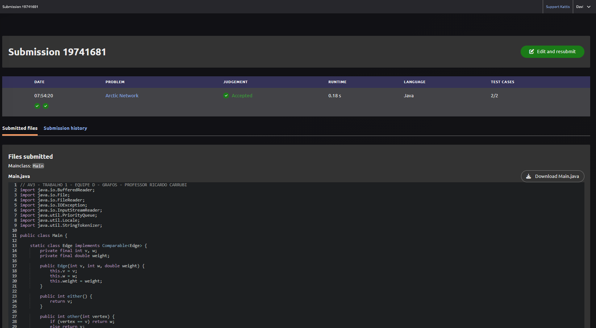

```markdown
# Trabalho 1: Árvore Geradora Mínima (MST) — Arctic Network

## Informações Gerais
* **Nome do Problema:** Arctic Network
* **Link do Problema:** [Kattis — Arctic Network](https://open.kattis.com/problems/arcticnetwork)
* **Linguagem Utilizada:** Java (JDK 8 ou superior)
* **Integrantes do Grupo D:**
  * [Davi Dias Vale]
  * [João Pedro Alexandrino Brasil]
  * [Lucas Lustosa da Costa Dias]

---
**
## Estrutura do Repositório

T1/
├── README.md
├── src/
│   └── Main.java
├── evidencias/
│   └── accepted.png
├── apresentacao/
│   └── apresentacao.pdf
└── dados/
    └── entradas_do_problema.txt

```

---

## Como Executar a Solução

O programa foi implementado com um **mecanismo de leitura híbrido/autônomo**. Ele tentará ler o arquivo `entradas_do_problema.txt` automaticamente a partir dos caminhos especificados pela estrutura do projeto. Caso seja executado em um ambiente sem os arquivos físicos (como os servidores do Kattis), ele redirecionará a leitura automaticamente para a entrada padrão do sistema (`System.in`).

### Opção 1: Executando a partir da raiz do projeto (`T1/`)

1. Abra o terminal na pasta raiz `T1/`.
2. Compile o código-fonte:
```bash
javac src/Main.java

```


3. Execute a aplicação:
```bash
java -cp src Main

```


### Opção 2: Executando de dentro da pasta de código (`T1/src/`)

1. Navegue até a pasta `src/`:
```bash
cd src

```


2. Compile o arquivo:
```bash
javac Main.java

```


3. Execute a aplicação:
```bash
java Main

```


---

## Modelagem e Estratégia Algorítmica

### 1. Modelagem como Grafo Ponderado

O problema consiste em interconectar postos avançados isolados minimizando o alcance máximo de rádio $D$. Ele foi modelado como um **Grafo Completo Não-Direcionado (Clique)**:

* **Vértices ($V$):** Cada um dos $P$ postos avançados mapeados por suas coordenadas cartesianas $(x, y)$.
* **Arestas ($E$):** Todos os caminhos possíveis ligando cada par de postos. Como o grafo é completo, geramos $E = \frac{P(P-1)}{2}$ arestas.
* **Pesos das Arestas ($W$):** A distância euclidiana geométrica calculada entre dois pontos coordenados:

$$W = \sqrt{(x_1 - x_2)^2 + (y_1 - y_2)^2}$$


### 2. Algoritmo Utilizado

Optamos pelo **Algoritmo de Kruskal**, cuja estratégia gulosa se encaixa perfeitamente na mecânica de interrupção ordenada demandada pelas restrições de satélite do problema.

### 3. Papel da Fila de Prioridade Mínima (`PriorityQueue`)

Em consonância com as estruturas estudadas na disciplina, utilizamos uma fila de prioridade mínima para gerenciar as arestas. Todas as arestas geradas são inseridas na `PriorityQueue`, o que nos garante acesso em tempo constante $O(1)$ à menor aresta global disponível a cada passo do algoritmo por meio da operação `.poll()` (equivalente ao `delMin()` dos slides).

### 4. Papel do Union-Find (`UF`)

A classe interna `UF` implementa a estrutura União-Busca com as otimizações de **Path Compression** (no método `find`) e **Union by Rank** (no método `union`). Suas funções no algoritmo de Kruskal são:

* **Detecção de Ciclos:** Através do método `connected(v, w)`, o algoritmo verifica se dois postos já pertencem ao mesmo componente conectado antes de ligá-los, evitando redundâncias e ciclos.
* **Controle de Componentes:** A variável interna `count` contabiliza o número atual de subárvores isoladas no grafo global. Cada união bem-sucedida decrementa esse contador.

### 5. Variação de MST Utilizada: Interrupção Precoce

Uma MST clássica conecta todos os nós formando um único componente estável ($count = 1$). A variação aplicada neste problema decorre da existência de $S$ canais de satélite. Como os satélites conectam qualquer distância de forma independente e gratuita, nós não precisamos de uma árvore geradora única conectada por rádio.

Podemos interromper a execução do Kruskal assim que restarem **exatamente $S$ componentes isolados** no Union-Find (`uf.count() == S`). Os satélites se encarregarão de unir esses $S$ blocos distantes. A última aresta de rádio computada antes da interrupção dita o valor mínimo ideal para o parâmetro de alcance $D$.

---

## Casos Especiais Tratados

1. **Mais Satélites que Postos ($S \ge P$):** Se o número de canais de satélite disponíveis for maior ou igual à quantidade de postos existentes, nenhuma infraestrutura de rádio é necessária. O algoritmo intercepta a condição no início e retorna a distância mínima $D = 0.00$.
2. **Tratamento de Linhas Vazias:** Arquivos de entrada em maratonas de programação frequentemente contêm quebras de linha residuais. O laço de leitura descarta linhas em branco e espaços vazios usando `.trim().isEmpty()` para evitar falhas de conversão de dados (*NumberFormatException*).
3. **Formatação de Saída:** Utilização explícita de `Locale.US` no escopo do `System.out.printf` para blindar a saída contra variações de sistema operacional, forçando a impressão de números decimais separados por ponto (ex: `212.13`) e não por vírgula.

---

## Análise de Complexidade

* **Espaço:** $O(P^2)$ para alocar e gerenciar todas as arestas possíveis na fila de prioridade.
* **Tempo:** * **Cálculo das Distâncias e Inserção na Fila:** Para um grafo completo, inserimos todas as arestas na fila em $O(P^2 \log P)$.
* **Processamento do Kruskal com DSU:** O laço consome $O(E \cdot \alpha(V))$, onde $\alpha$ é a função inversa de Ackermann (crescimento infinitesimal, praticamente constante).
* **Complexidade Total:** Domínio de **$O(P^2 \log P)$**. Para o teto do problema ($P = 500$), o volume máximo de operações simuladas aproxima-se de $2.25 \times 10^6$, executando em poucos milissegundos — bem abaixo do limite de 1.0 segundo imposto pelo Kattis.


---

## Comprovação de Submissão

O código foi submetido na plataforma oficial do problema e obteve o veredito de **Accepted**.


